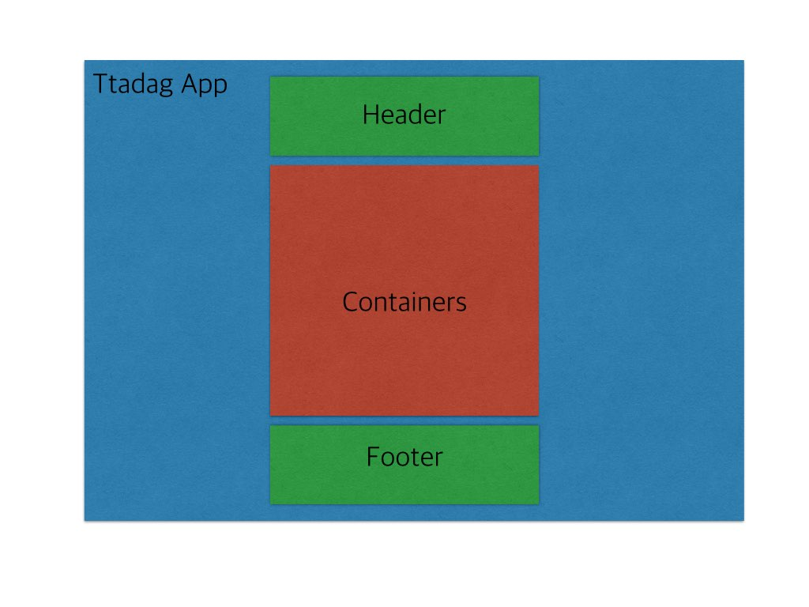

### ttadag Start!!! 

### node express document root

1. 일단 현재는 nodejs 는 server 구동용으로만 사용될듯..(db, api 상황에 따라 대응...)
2. 추후 확장성이나 서비스의 내용에따른 고려..
3. angular version 패키지 관리자 bower 사용
4. nodejs express
5. app/ : 클라이언트 script 
6. assets : ttadag app의 전체적인 자산을 관리

### App Configuration

## 각 뷰의 레이아웃 구성도 및 명칭

Ttadag App : App의 전체적인 틀이 구성되며 각각의 Header, Containers, Footer 등의 모듈단위의 내용등을 포함하고 관리한다.(Services)  
Header : App의 주된 기능은 Nav기능이 포함되며, 필요에따라 레이어팝업 기능이 추가된다. (Factories)  
Container : AngularJS Route의 change 이벤트가 발생할될때 마다 실질적인 App내의 ChangeView가 일어나는곳이다.(Services or Factories 구성 예정)  
Footer : App의 필요에따라 Header와 마찬가지로 Nav기능이 포함되며, 필요에 따라 레이어 팝업 기능이 추가될 수 있다. (Factoires)  